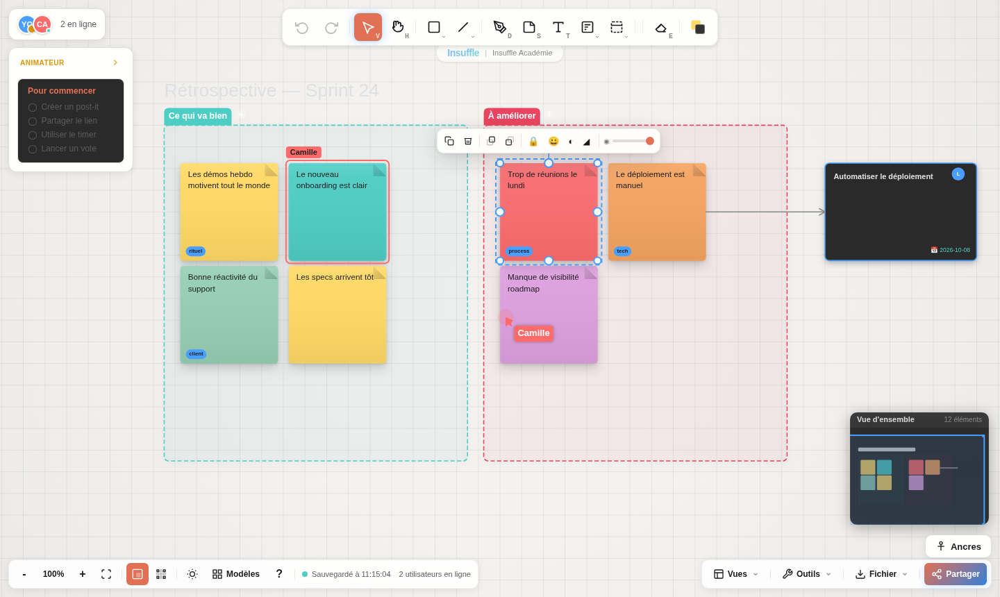

<div align="center">

# DarkBoard

**Le tableau blanc collaboratif qui démarre en un clic.**
Pas de compte, pas d'installation, pas de friction — vous ouvrez un lien, vous écrivez.

[](LICENSE)
[](https://nodejs.org)
[](#tests)
[](CONTRIBUTING.md)

[**Essayer en ligne**](https://darkboard.insuffle.com) · [Contribuer](CONTRIBUTING.md) · [Signaler un bug](https://github.com/ylureault/darkboard/issues/new?template=bug.yml) · [Insuffle](https://insuffle.com)



</div>

---

## Ce que c'est

DarkBoard est un tableau blanc temps réel pensé pour **animer des ateliers** : rétrospectives, brainstorms, priorisation, cadrage produit. Il tient en quatre fichiers Node et n'a besoin ni de base de données, ni de compte utilisateur, ni de build.

Vous partagez l'URL, les autres arrivent. C'est tout.

```bash
git clone https://github.com/ylureault/darkboard.git
cd darkboard && npm install && npm start
# → http://localhost:3000
```

## Pourquoi il existe

La plupart des tableaux collaboratifs demandent une inscription avant d'avoir écrit la première idée. En atelier, ces deux minutes coûtent cher : l'énergie du groupe retombe pendant que trois personnes cherchent leur mot de passe.

DarkBoard enlève cette étape. Le prix à payer est assumé — pas de comptes, donc pas de permissions fines ni d'historique par personne. C'est un outil d'atelier, pas un coffre-fort documentaire.

## Ce qu'il sait faire

**On voit qui fait quoi.** Les curseurs des participants se déplacent en direct, et **la sélection de chacun est entourée de sa couleur avec son nom** — vous voyez sur quoi votre collègue travaille avant même qu'il le dise.

**Tout le nécessaire d'un atelier.** Post-its, formes, connecteurs, dessin libre, cadres, cartes, listes, mind maps, images.

**Des outils d'animation.** Minuteur partagé, vote à quota, mode isoloir (chacun écrit sans voir les autres), suivez-moi, tour de table, check-in, matrice de priorisation, clustering automatique, ROTI, nuage de mots.

**Ça entre et ça sort.** Import CSV, Markdown, Miro, Draft.io, JSON. Export PNG, CSV, JSON.

**Ça reste lisible.** Les outils proches sont regroupés derrière un bouton : la barre affiche une dizaine de choix, pas soixante. Vue d'ensemble, ancres de navigation, vues Tableau et Kanban, mode présentation.

<div align="center">

<sub><i>Thème clair et thème sombre, au choix.</i></sub>
</div>

## Comment c'est construit

Volontairement simple : **aucun framework, aucune étape de build.** Du JavaScript que l'on ouvre et que l'on lit.

```
server.js            Express + WebSocket
lib/
  ws-handler.js      routage et validation des messages temps réel
  boards.js          état des tableaux et persistance disque
  board-cleanup.js   archivage des tableaux inactifs
public/js/
  app.js             orchestration, historique, presse-papiers
  canvas.js          moteur de rendu, caméra, vue d'ensemble
  objects.js         dessin et test de collision par type d'élément
  tools.js           comportement de chaque outil
  sync.js            client WebSocket, file hors-ligne, reconnexion
  toolgroups.js      regroupement des contrôles
  workshop.js        minuteur, vote, isoloir, animation
```

Le rendu passe par un seul `<canvas>`. L'état se synchronise par des **opérations** (`add` / `update` / `delete`) diffusées à tout le monde, ce qui donne l'annulation et le temps réel avec le même mécanisme.

## Tests

```bash
npm test          # 112 tests client + 67 serveur
npm run test:e2e  # 51 vérifications dans un vrai Chromium
```

Les tests de bout en bout pilotent un navigateur : ils créent des éléments, glissent à la souris, annulent au clavier et **échouent sur la moindre erreur console**. C'est ce qui attrape ce que la relecture laisse passer.

> `npm run test:e2e` a besoin de `playwright-core` et d'un Chromium. Sans eux, il se saute proprement.
> ```bash
> npm install --no-save playwright-core
> CHROMIUM_PATH=/chemin/vers/chromium npm run test:e2e
> ```

## Contribuer

Le projet est ouvert et les contributions sont les bienvenues — correction, traduction, idée d'atelier, refonte d'un écran.

Vous n'avez pas besoin de permission pour commencer : prenez une [issue](https://github.com/ylureault/darkboard/issues), ou ouvrez-en une pour décrire ce que vous voulez faire. **[CONTRIBUTING.md](CONTRIBUTING.md)** explique l'installation, les conventions et ce que fait une bonne pull request. Les débutants sont explicitement les bienvenus — cherchez le label `good first issue`.

Tout le monde s'engage à respecter le [code de conduite](CODE_OF_CONDUCT.md).

## L'écosystème Insuffle

DarkBoard fait partie d'une famille d'outils pour les équipes produit :

| | |
|---|---|
| [**Insuffle**](https://insuffle.com) | Le site principal : accompagnement et formation des équipes produit. |
| [**DarkBoard**](https://darkboard.insuffle.com) | Ce projet — le tableau blanc d'atelier. |
| [**Cadrage**](https://cadrage.insuffle.com) | Cadrage produit et espaces de travail. Voir [l'intégration](docs/integration-cadrage-insuffle.md). |
| [**Boussole**](https://boussole.insuffle.com) | Orientation et diagnostic d'équipe. |

## Licence

[MIT](LICENSE) — utilisez-le, modifiez-le, déployez-le, y compris en contexte commercial.

<div align="center">
<sub>Construit par <a href="https://insuffle.com">Insuffle</a> et ses contributeurs.</sub>
</div>
